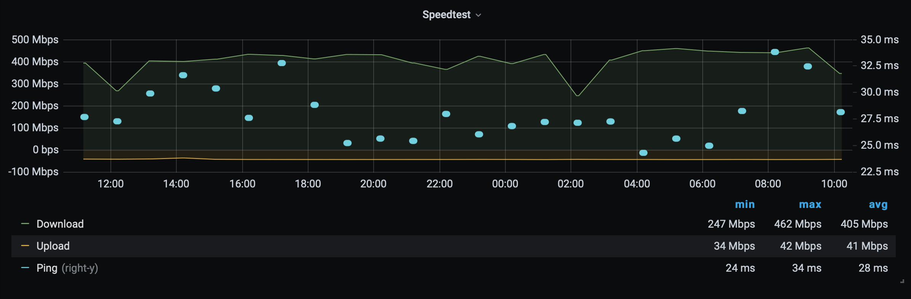

# speedtest-exporter

Simple Python/Flask wrapper around [speedtest-cli](https://github.com/sivel/speedtest-cli) that can be scraped by [Prometheus](https://prometheus.io).

## Grafana

Here's what I'm doing as far as Grafana goes:



Here's the panel JSON:

```json
{
  "aliasColors": {},
  "bars": false,
  "dashLength": 10,
  "dashes": false,
  "fieldConfig": {
    "defaults": {
      "custom": {},
      "links": []
    },
    "overrides": []
  },
  "fill": 1,
  "fillGradient": 0,
  "gridPos": {
    "h": 10,
    "w": 18,
    "x": 0,
    "y": 9
  },
  "hiddenSeries": false,
  "id": 4,
  "legend": {
    "alignAsTable": true,
    "avg": true,
    "current": false,
    "max": true,
    "min": true,
    "show": true,
    "total": false,
    "values": true
  },
  "lines": true,
  "linewidth": 1,
  "nullPointMode": "connected",
  "percentage": false,
  "pluginVersion": "7.1.5",
  "pointradius": 2,
  "points": false,
  "renderer": "flot",
  "seriesOverrides": [
    {
      "$$hashKey": "object:116",
      "alias": "Upload",
      "transform": "negative-Y"
    },
    {
      "$$hashKey": "object:123",
      "alias": "Ping",
      "fill": 0,
      "nullPointMode": "null",
      "pointradius": 3,
      "points": true,
      "yaxis": 2
    }
  ],
  "spaceLength": 10,
  "stack": false,
  "steppedLine": false,
  "targets": [
    {
      "expr": "speedtest_download",
      "interval": "",
      "legendFormat": "Download",
      "refId": "A"
    },
    {
      "expr": "speedtest_upload",
      "interval": "",
      "legendFormat": "Upload",
      "refId": "B"
    },
    {
      "expr": "speedtest_ping",
      "interval": "",
      "legendFormat": "Ping",
      "refId": "C"
    }
  ],
  "thresholds": [],
  "timeFrom": null,
  "timeRegions": [],
  "timeShift": null,
  "title": "Speedtest",
  "tooltip": {
    "shared": true,
    "sort": 0,
    "value_type": "individual"
  },
  "transparent": true,
  "type": "graph",
  "xaxis": {
    "buckets": null,
    "mode": "time",
    "name": null,
    "show": true,
    "values": []
  },
  "yaxes": [
    {
      "$$hashKey": "object:67",
      "format": "bps",
      "label": null,
      "logBase": 1,
      "max": null,
      "min": null,
      "show": true
    },
    {
      "$$hashKey": "object:68",
      "format": "ms",
      "label": null,
      "logBase": 1,
      "max": null,
      "min": null,
      "show": true
    }
  ],
  "yaxis": {
    "align": false,
    "alignLevel": null
  },
  "datasource": null
}
```

## Docker

Building the image:

```bash
❯ make build
docker build -t speedtest-exporter:latest .
Sending build context to Docker daemon  46.59kB
Step 1/9 : FROM ubuntu:18.04
 ---> 6526a1858e5d
Step 2/9 : RUN apt update
 ---> Using cache
 ---> 77d7a2b22ac0
Step 3/9 : RUN apt-get -y install python3 python3-pip speedtest-cli
 ---> Using cache
 ---> b5d111eccd60
Step 4/9 : RUN  mkdir /app
 ---> Using cache
 ---> 0b16ea72dbb5
Step 5/9 : COPY ./requirements.txt /app/requirements.txt
 ---> Using cache
 ---> a947310d0f3b
Step 6/9 : RUN  pip3 install -r /app/requirements.txt
 ---> Using cache
 ---> 30d21017fcd0
Step 7/9 : COPY speedtest-exporter.py /app
 ---> Using cache
 ---> a32d807d5b74
Step 8/9 : ENTRYPOINT [ "python3" ]
 ---> Using cache
 ---> 03e43e16db12
Step 9/9 : CMD [ "/app/speedtest-exporter.py" ]
 ---> Using cache
 ---> 325b8c807884
Successfully built 325b8c807884
Successfully tagged speedtest-exporter:latest
```

Running the image:

```bash
❯ make run
docker run --rm -p 10101:10101/tcp speedtest-exporter:latest
 * Serving Flask app "speedtest-exporter" (lazy loading)
 * Environment: production
   WARNING: This is a development server. Do not use it in a production deployment.
   Use a production WSGI server instead.
 * Debug mode: on
 * Running on http://0.0.0.0:10101/ (Press CTRL+C to quit)
 * Restarting with stat
 * Debugger is active!
 * Debugger PIN: 224-887-530
172.17.0.1 - - [04/Sep/2020 01:14:47] "GET / HTTP/1.1" 200 -
```

Scraping the image:

```bash
❯ curl http://127.0.0.1:10101/
speedtest_download{server_name="Flint, MI",server_sponsor="University of Michigan-Flint",client_ip="68.64.123.31",client_isp="Comcast Cable",client_isp_rating="3.7"} 156176559.0272518
speedtest_upload{server_name="Flint, MI",server_sponsor="University of Michigan-Flint",client_ip="68.64.123.31",client_isp="Comcast Cable",client_isp_rating="3.7"} 4116218.0672557084
speedtest_ping{server_name="Flint, MI",server_sponsor="University of Michigan-Flint",client_ip="68.64.123.31",client_isp="Comcast Cable",client_isp_rating="3.7"} 31.953
speedtest_bytes_sent{server_name="Flint, MI",server_sponsor="University of Michigan-Flint",client_ip="68.64.123.31",client_isp="Comcast Cable",client_isp_rating="3.7"} 5242880
speedtest_bytes_received{server_name="Flint, MI",server_sponsor="University of Michigan-Flint",client_ip="68.64.123.31",client_isp="Comcast Cable",client_isp_rating="3.7"} 195737692◁
```

## Local

```bash
❯ make install
...
```

This'll copy the script to `/usr/local/bin/speedtest-exporter.py`, the systemd unit file to `/etc/systemd/system/speedtest-exporter.service`, reload systemd, and lastly, enable and start `speedtest-exporter`.
